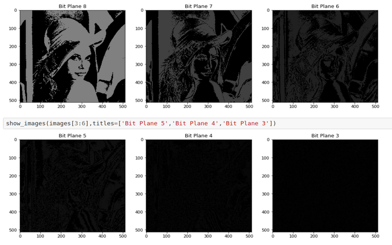

# Image Processing

Implementation of various image processing algorithms. The notebooks `bit_place_slicing` and `histogram_equalization` can be run through [Google Colaboratory](https://colab.research.google.com).

